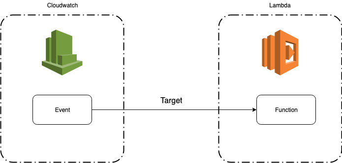

  

<h1 align="center">
  f50-cron
   
</h1>

  Create your cronjob with Lambda and Cloudwatch in seconds

  

## Why you should use this boilerplate:

- Easy to setup, you can setup a cronjob in less than 1 min.

- Saving cost, lambda free tier has 1M free requests per month.

## Quick start

### Prerequisites

Following are the minimum tested versions for the tools and libraries you need for running this project:

- Docker: 18.09.2, build 6247962 or newer
- An AWS account

### Install

1.  Clone this repo using `git clone --depth=1 https://github.com/particle4dev/f50-cron.git <YOUR_PROJECT_NAME>`
2.  Move to the appropriate directory: `cd <YOUR_PROJECT_NAME>`. 
3.  Fill your config in `bin/.env` file. 

    - AWS_DEFAULT_PROFILE: Specifies the name of the CLI profile with the credentials and options to use

    - AWS_ACCESS_KEY_ID: Specifies an AWS access key associated with an IAM user or role

    - AWS_SECRET_ACCESS_KEY: Specifies the secret key associated with the access key.

    - AWS_DEFAULT_REGION: Specifies the AWS Region to send the request to

    - SERVICE_NAME: Specifies the name of cronjob

    - STATE_S3_BUCKET: Specifies the S3 bucket that Terraform will store the state

    - STATE_S3_KEY: Specifies the file on S3 bucket that Terraform state will be written to it

4. Run `./bin/snail init` to initialize a working directory containing Terraform configuration files. 
5. Run `./bin/snail build` to build the lambda function, for compilation, deployment. 
6. Run `./bin/snail deploy` to apply the changes required to reach the desired state of the configuration.

Now you've just finished deploying a cronjob on AWS Lambda. 

## Project structure

- [packages/infrastructure](packages/infrastructure): Terraform code that will create Lambda and Cloudwatch

- [packages/src](packages/src): Nodejs code that run on lambda 

- [packages/static](packages/static): Static file such as html, images or css files

## Built With

* [Terraform](https://www.terraform.io/) - Write, Plan, and Create Infrastructure as Code
* [Docker](https://www.docker.com/) - Build, secure and manage applications

## Contributing

Please read [CONTRIBUTING.md](CONTRIBUTING.md) for details on our code of conduct, and the process for submitting pull requests to us.

## Versioning

We use [SemVer](http://semver.org/) for versioning. For the versions available, see the [tags on this repository](https://github.com/particle4dev/f50-cron/releases). 

## Authors

* **Nam Hoang** - *Initial work* - [particle4dev](https://github.com/particle4dev)

See also the list of [contributors](AUTHORS) who participated in this project.

## License

This project is licensed under the MIT License - see the [LICENSE.md](LICENSE.md) file for details
